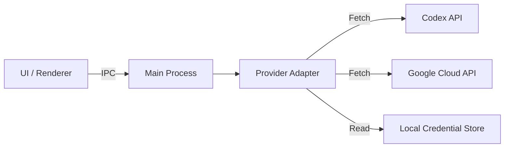

<div align="center">

# Quota Pulse Dashboard
### Premium OAuth Usage Monitoring & Configuration Manager

[](https://www.electronjs.org/)
[]()
[]()

<p align="center">
  <a href="#-english">English</a> •
  <a href="#-korean">한국어 (Korean)</a>
</p>

</div>

---

<a id="-english"></a>

## 💎 English

### 📖 Overview
**Quota Pulse** is a high-performance, glassmorphic Electron dashboard designed to monitor real-time API usage for AI coding assistants. It acts as a centralized control center for **Codex (OpenAI)** and **Antigravity (Google)** integrations, offering deep visibility into rate limits and automated configuration management for the `oh-my-opencode` ecosystem.

### ✨ Key Features

#### 1. Real-time Quota Intelligence
- **Codex (OpenAI)**: Visualizes both **5-hour sliding windows** and **weekly caps** with precise reset timers.
- **Antigravity (Google)**: Monitors **Cloud Code** and **Gemini CLI** quotas separately, handling token refresh cycles automatically.
- **Auto-Refresh**: Background polling ensures data is always up-to-date without manual intervention.

#### 2. Advanced Configuration Editor
- **Atomic Management**: Safely edit `oh-my-opencode.json` with atomic write guarantees.
- **Bulk Operations**: Swap AI models across all agent categories in a single click.
- **Smart Resolution**: Automatically detects configuration paths following **XDG standards** across Windows and macOS/Linux.

#### 3. Premium UX/UI
- **Glassmorphism**: State-of-the-art UI with frosted glass effects, noise textures, and smooth spring animations.
- **Context-Aware**: Dynamic UI that adapts to the active provider and system state.

### 🏗 Architecture

The application is built on the **Adapter Pattern**, abstracting diverse API providers into a unified contract.



- **`providers/codex.js`**: Maps OpenAI usage windows.
- **`providers/antigravity.js`**: Interfaces with internal Google Cloud endpoints.
- **`providers/credentials.js`**: Securely resolves tokens from the filesystem (never exposed to UI).

### 🚀 Getting Started

#### Prerequisites
- **Node.js**: v18 LTS or higher
- **npm**: v9 or higher

#### Installation

1. **Clone the repository**
   ```bash
   git clone <repository-url>
   cd quota-pulse
   ```

2. **Install dependencies**
   ```bash
   npm install
   ```

3. **Run the application**
   ```bash
   npm start
   ```

### 📂 File Structure & Configuration

Quota Pulse adheres to **XDG Base Directory** standards.

| File Type | macOS / Linux | Windows |
|-----------|---------------|---------|
| **Configuration** | `~/.config/opencode/oh-my-opencode.json` | `%APPDATA%\opencode\oh-my-opencode.json` |
| **Authentication** | `~/.local/share/opencode/auth.json` | `%APPDATA%\opencode\auth.json` |

> **Note**: Sensitive files like `auth.json` are never committed to version control.

---

<a id="-korean"></a>

## 🇰🇷 한국어

### 📖 개요
**Quota Pulse**는 AI 코딩 어시스턴트의 API 사용량을 실시간으로 모니터링하기 위해 설계된 프리미엄 Electron 대시보드입니다. **Codex (OpenAI)** 및 **Antigravity (Google)** 연동을 위한 중앙 제어 센터 역할을 수행하며, `oh-my-opencode` 생태계를 위한 정교한 설정 관리 기능을 제공합니다.

### ✨ 주요 기능

#### 1. 실시간 쿼터 인텔리전스 (Quota Intelligence)
- **Codex (OpenAI)**: **5시간 윈도우** 및 **주간 한도**를 시각화하고 정확한 초기화 타이머를 제공합니다.
- **Antigravity (Google)**: **Cloud Code**와 **Gemini CLI** 쿼터를 분리하여 모니터링하며, 토큰 갱신 주기를 자동으로 관리합니다.
- **자동 갱신**: 백그라운드 폴링을 통해 별도의 조작 없이 항상 최신 데이터를 유지합니다.

#### 2. 고급 설정 편집기 (Configuration Editor)
- **원자적 관리 (Atomic Management)**: 데이터 손실 없이 `oh-my-opencode.json` 설정을 안전하게 수정합니다.
- **일괄 작업 (Bulk Operations)**: 클릭 한 번으로 모든 에이전트 카테고리의 AI 모델을 교체할 수 있습니다.
- **스마트 경로 탐색**: Windows 및 macOS/Linux 환경에서 **XDG 표준**을 따르는 설정 파일 경로를 자동으로 감지합니다.

#### 3. 프리미엄 UX/UI
- **글래스모피즘 (Glassmorphism)**: 프로스트 글래스 효과, 노이즈 텍스처, 부드러운 스프링 애니메이션이 적용된 최신 UI를 제공합니다.
- **컨텍스트 인식**: 활성화된 공급자와 시스템 상태에 따라 UI가 동적으로 반응합니다.

### 🏗 아키텍처

이 애플리케이션은 **어댑터 패턴(Adapter Pattern)**을 기반으로 구축되어, 다양한 API 공급자를 통일된 규격으로 추상화합니다.

- **Renderer Process**: 사용자 인터페이스 및 상태 관리.
- **Main Process**: 보안이 중요한 API 통신 및 파일 시스템 접근 담당.
- **Provider Layer**: `providers/` 디렉토리 내에서 각 서비스(Codex, Antigravity)의 고유한 로직을 처리하고 표준화된 데이터를 반환합니다.

### 🚀 시작하기

#### 필수 요구사항
- **Node.js**: v18 LTS 이상
- **npm**: v9 이상

#### 설치 및 실행

1. **저장소 클론**
   ```bash
   git clone <repository-url>
   cd quota-pulse
   ```

2. **의존성 패키지 설치**
   ```bash
   npm install
   ```

3. **애플리케이션 실행**
   ```bash
   npm start
   ```

### 📂 파일 구조 및 설정

Quota Pulse는 **XDG Base Directory** 표준을 엄격히 준수합니다.

| 파일 유형 | macOS / Linux | Windows |
|-----------|---------------|---------|
| **설정 파일** | `~/.config/opencode/oh-my-opencode.json` | `%APPDATA%\opencode\oh-my-opencode.json` |
| **인증 파일** | `~/.local/share/opencode/auth.json` | `%APPDATA%\opencode\auth.json` |

> **주의**: `auth.json`과 같은 민감한 인증 정보 파일은 절대 버전 관리 시스템(Git)에 커밋하지 마십시오.

---

<p align="center">
  © 2026 Quota Pulse. All Rights Reserved.
</p>
